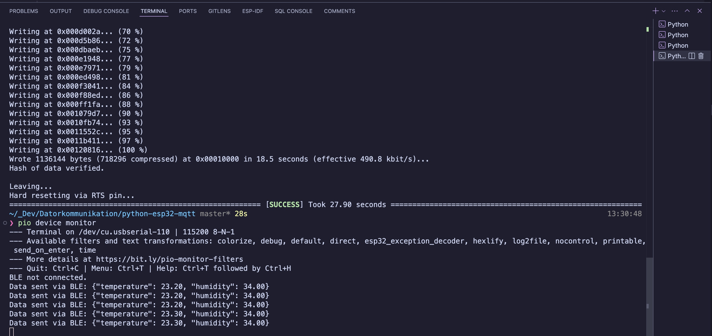
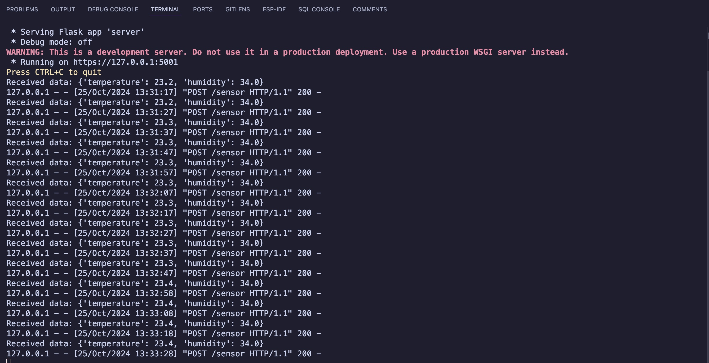
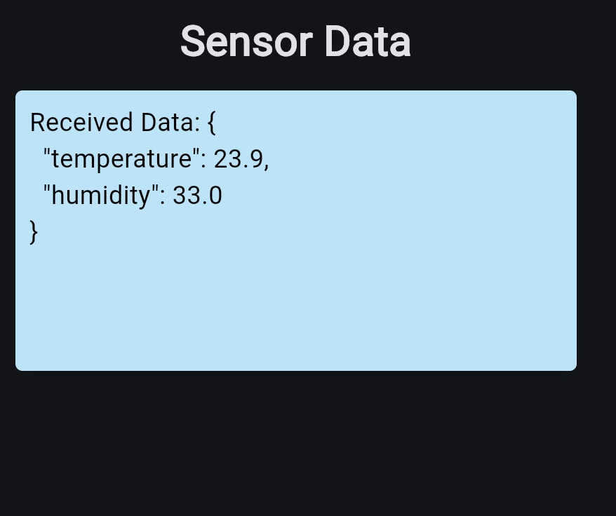
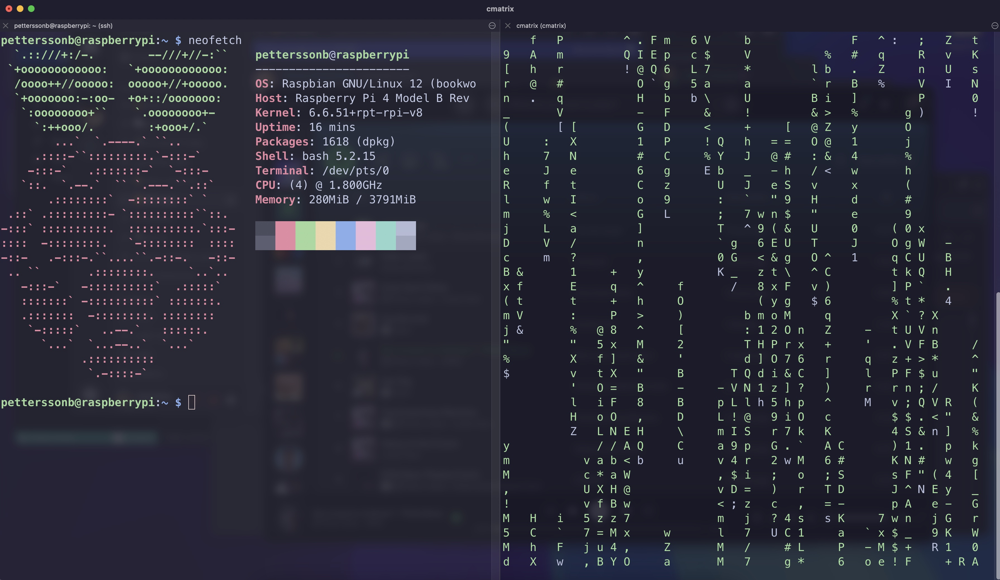
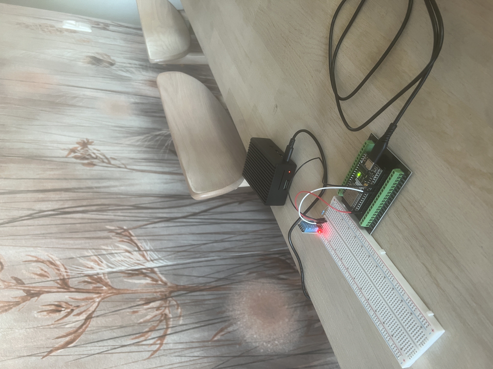

# Program Screenshots

## This section contains various screenshots showcasing the program in action.

## ESP32 Sending Json object over BLE

Description: This screenshot shows the ESP32 microcontroller transmitting sensor data in JSON format over Bluetooth Low Energy (BLE), demonstrating the initial step of data collection and transmission in the IoT solution.

## BLE Server forwarding the Json object via HTTPS

Description: Here, the BLE server is receiving the JSON object from the ESP32 over BLE and securely forwarding the data to the Flask server using HTTPS, ensuring encrypted transmission to protect data integrity.

## Flask server receiving Json object and forwarding it via Netbird VPN

Description: This screenshot captures the Flask server receiving the JSON object over HTTPS and forwarding it to the Raspberry Pi MQTT broker through the Netbird VPN, illustrating secure end-to-end data flow across the system.

### MQTT Subscribe

Description: The Flet application interface displays the subscribed data, showing real-time sensor readings received on the sensor/data topic, demonstrating effective data monitoring for the end-user.

### SSH

Description: This screenshot highlights the SSH connection to the Raspberry Pi, allowing remote access and control, essential for managing the IoT setup and performing maintenance tasks securely.

### Setup

Description: The physical setup of the IoT solution, showing the DHT11 sensor connected to the ESP32 for data collection and the Raspberry Pi with its power cable, illustrating the hardware components in use

