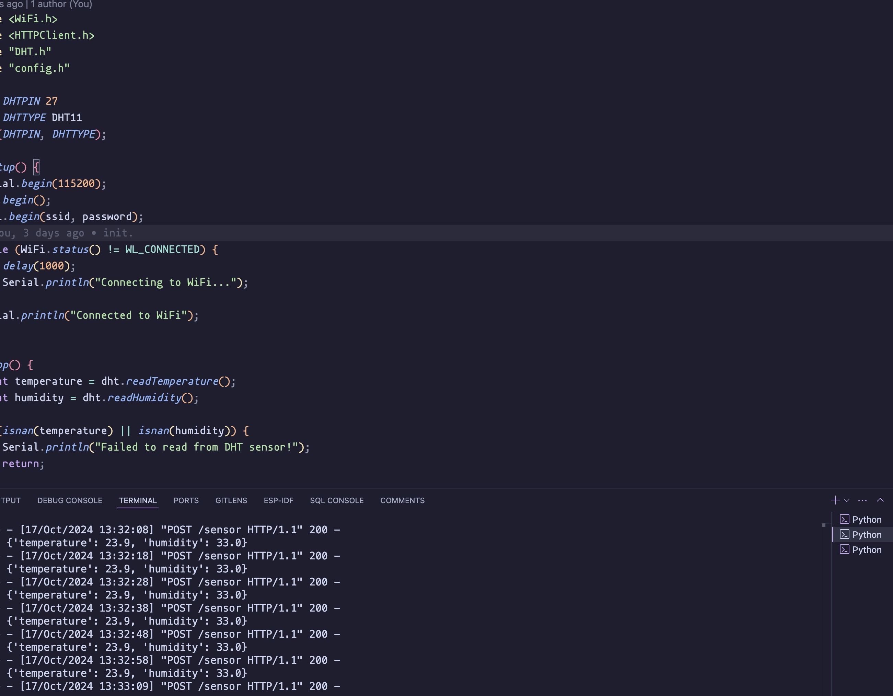
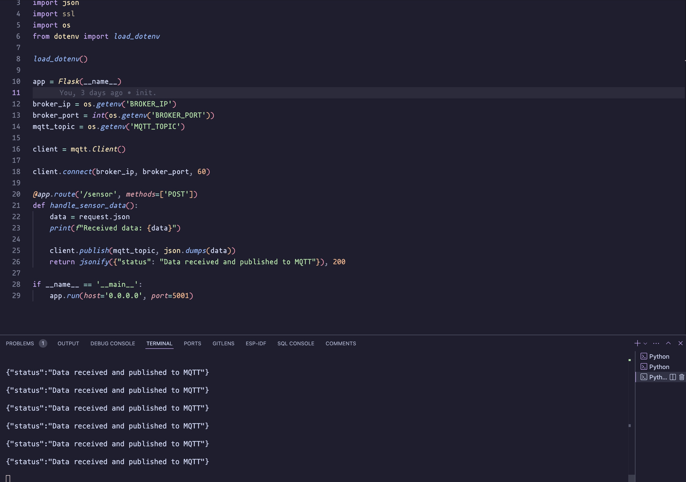
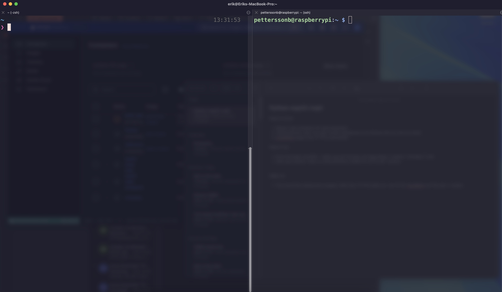

# Program Screenshots

## This section contains various screenshots showcasing the program in action.

### ESP32 Communication with Flask Server

Description: Screenshot showing the ESP32 sending data to the Flask server.

### MQTT Broker Receiving Data

Description: MQTT broker on the Raspberry Pi receiving data over the secure connection.

### MQTT Subscribe

Description: The flet app interface that showcases what data it receives when subscribing to sensor/data topic.

### SSH

Description: The ssh connection to the rpi

### Setup

Description: DHT11 sensor connected to the ESP32 and the RPI hooked up to power cable.

